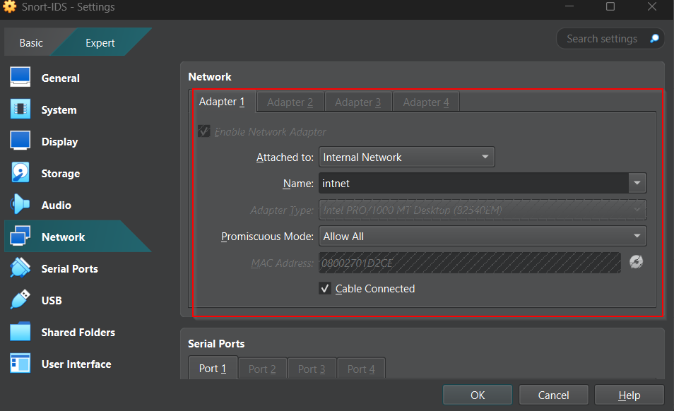
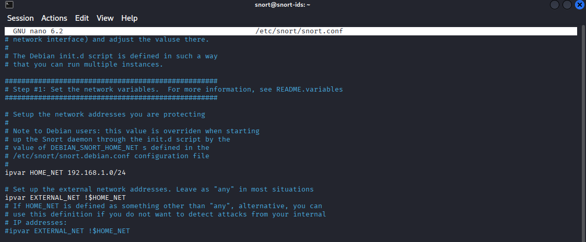
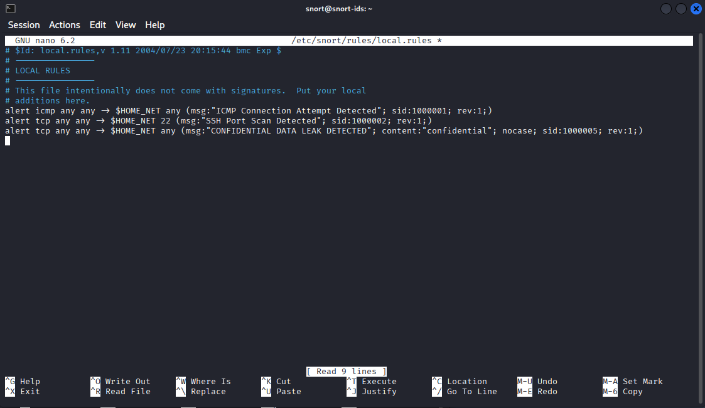
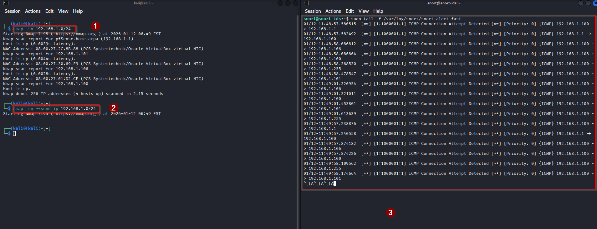
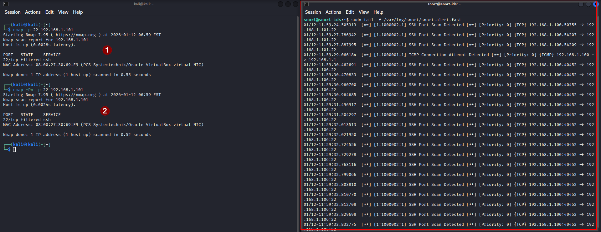
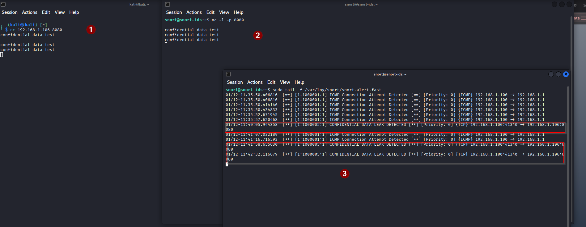
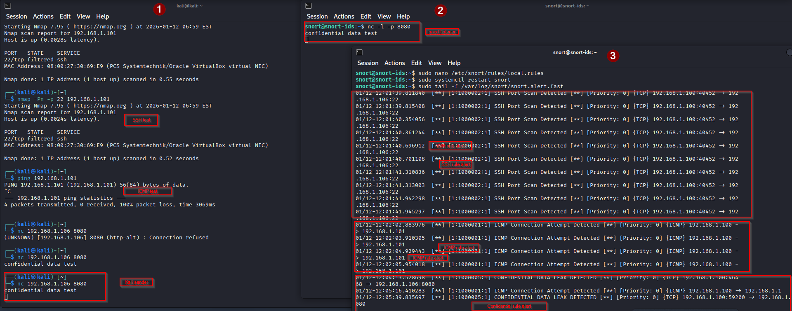

+++
title= "Building a Network Intrusion Detection System (IDS) Lab with Snort"
date= 2026-01-12
draft= false
categories= ["Linux","Cybersecurity", "Home Lab"]
tags= ["Snort", "pfSense", "NIDS", "Firewall"]
+++

## Project Overview

In this project, I designed and deployed a secure virtual lab to simulate real-world network attacks. The goal was to configure **Snort** as a Network Intrusion Detection System (NIDS) to detect malicious traffic—specifically Pings, Port Scans, and Data Leaks—moving between a "Attacker" machine and a "Victim" machine.

This lab demonstrates how to gain deep visibility into internal network traffic using **Deep Packet Inspection (DPI)**.


## Tools and Configurations

I created a custom isolated network using VirtualBox to ensure traffic was isolated but visible to the IDS.

- **Gateway**: pfSense (NAT + Internal Network)

- **Attacker**: Kali Linux (Internal Network)

- **Victim**: Windows 10 (Internal Network)

- **IDS**: Ubuntu Server 22.04 -`Running Snort` (Internal Network)

## The Setup Phase

## Enabling Visisbility(The "Wiretap")
The most important configuration step was in VirtualBox. By default, VMs only see traffic meant for them.
To make Snort act as a "wiretap," I had to enable Promiscuous Mode: `Allow All` on the Ubuntu network adapter.
- **Settings**: Network > Adapter 1 > Advanced > **Promiscuous Mode**
- **Value**: `Allow All`

Without this, Snort is blind to attacks against the Windows machine.

## Snort Configuration (`snort.conf`)
I configured `/etc/snort/snort.conf` to define my network environment, ensuring Snort knows what to protect `(HOME_NET)` and what to treat as hostile `(EXTERNAL_NET)`
.
```bash
sudo nano /etc/snort/snort.conf
```
```
# Define local network
ipvar HOME_NET 192.168.1.0/24

# Treat everything else as external
ipvar EXTERNAL_NET !$HOME_NET
```


## Custom Detection Rules(`local.rules`)
I wrote three custom rules to test different detection capabilities:
```bash
sudo nano /etc/snort/rules/local.rules
```
### Rule A: Detecting ICMP (Ping) Sweeps
```
alert icmp any any -> $HOME_NET any (msg:"ICMP Connection Attempt Detected"; sid:1000001; rev:1;)
```
### Rule B: Detecting SSH Port Scans
```
alert tcp any any -> $HOME_NET 22 (msg:"SSH Port Scan Detected"; sid:1000002; rev:1;)
```
### Rule C: Data Loss Prevention (DLP)
This rule uses Deep Packet Inspection to look for the specific string "confidential" inside TCP packets.
```
alert tcp any any -> $HOME_NET any (msg:"CONFIDENTIAL DATA LEAK DETECTED"; content:"confidential"; nocase; sid:1000005; rev:1;)
```


## Challenges & Troubleshooting
Real labs never work perfectly on the first try. Here are the specific "Gotchas" I encountered and solved:
### 1. The "Silent" Nmap Scan
**Problem**: I ran `nmap -sn 192.168.1.0/24` to sweep the network, but Snort remained silent.
**Root Cause**: On a local LAN, Nmap uses ARP (Address Resolution Protocol) to find hosts, not ICMP. My rule was strictly looking for ICMP packets.
**Solution**: I forced Nmap to use IP packets:
```bash
nmap -sn --send-ip 192.168.1.0/24
```
### 2. The SSH "Infinite Loop"
**Problem**: I was monitoring the logs via SSH using `tail -f`. When Snort detected an SSH scan, it wrote a log entry. That log text was sent over my SSH connection, which Snort detected as more SSH traffic, triggering another alert.
**Result**: An infinite loop of scrolling alerts that flooded the console.
**Solution**: I temporarily disabled the SSH rule (`#`) during the review phase to break the feedback loop.
### 3. Windows Firewall Blocking
**Problem**: Scanning the Windows VM returned "Host Down".
**Root Cause**: Windows Defender Firewall blocks ICMP (Ping) by default.
**Solution**: Used the `-Pn` flag in Nmap to skip the ping check and force the scan:
```bash
nmap -Pn -p 22 192.168.1.101
```

## The Results
To get real time results on snort, I used 
```bash
sudo tail -f /var/log/snort/snort.alert.fast
```

### Scenario 1: Detecting ICMP (ping) sweep
I pinged windows IP from kali and it triggered the ICMP rule immediately.
I also ran a scan to sweep the network and the ICMP rule was triggered.


### Scenario 2: Detecting SSH Port Scans
I scanned the IDS server from Kali triggered the TCP rule immediately.


### Scenario 3: Catching Data Exfiltration
I used `netcat` to simulate a hacker stealing sensitive data.
- **Attacker Command** (Kali)
```bash
nc 192.168.1.106 8080
confidential data test
```
- **Lister command** (snort)
```bash
nc -l -p 8080
confidential data test
```


### Summary Log Ouputt
The summary of  `Log Output` are as shown on the screenshot below:


## Conclusion
This project successfully demonstrated how to build a functional IDS for free using VirtualBox and Snort. The lab proved that **Promiscuous Mode** is essential for network monitoring and that writing custom rules allows for detecting specific threats—even "invisible" ones like specific keywords inside a packet.
